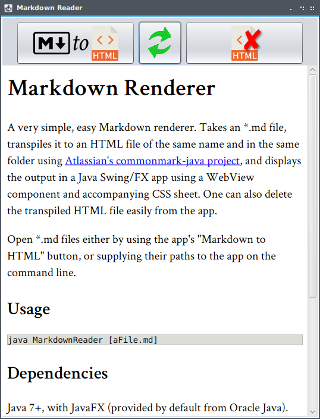

# Markdown Renderer



A very simple, easy Markdown renderer. Takes an *.md file, transpiles it to an HTML file of the same name and in the same folder using [Atlassian's commonmark-java project](https://github.com/atlassian/commonmark-java), and displays the output in a Java Swing/FX app using a WebView component and accompanying CSS sheet. One can also delete the transpiled HTML file easily from the app.

Open *.md files either by using the app's "Markdown to HTML" button, or supplying their paths to the app on the command line.

## Usage

Just call Java on the MarkdownReader class, optionally passing the path to an *.md file:

```
java MarkdownReader [aFile.md]
```

If you want to customize the styling, simply customize or replace the style.css file in the resources folder.

## Dependencies

Java 7+, with JavaFX (provided by default from Oracle Java). Ubuntu users and others using OpenJDK might need to install OpenJFX:

```
sudo apt install openjfx
```

## Licensing Notes & Acknowledgements

This software is under MIT License. It makes use of free icons from [Flaticon.com](https://flaticon.com), and [Atlassian's commonmark-java software](https://github.com/atlassian/commonmark-java), itself under the BSD 2-Clause "Simplified" License.