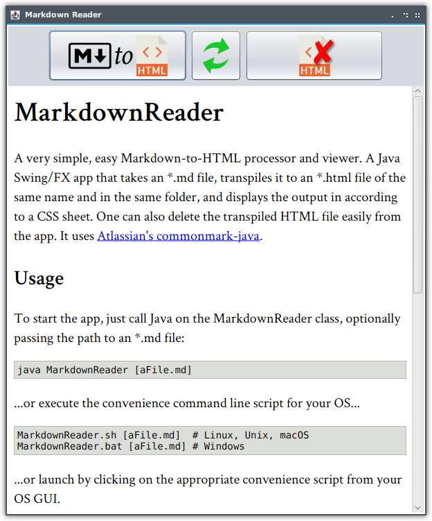

# MarkdownReader



A very simple, easy Markdown-to-HTML processor and viewer. A Java Swing/FX app that takes an *.md file, transpiles it to an *.html file of the same name and in the same folder, and displays the output in according to a CSS sheet. One can also delete the transpiled HTML file easily from the app. It uses [Atlassian's commonmark-java](https://github.com/atlassian/commonmark-java).

## Usage

To start the app, just call Java on the MarkdownReader class, optionally passing the path to an *.md file:

```bash
java MarkdownReader [aFile.md]
```

...or execute the convenience command line script for your OS...

```bash
MarkdownReader.sh [aFile.md]  # Linux, Unix, macOS
MarkdownReader.bat [aFile.md] # Windows
```

...or launch by clicking on the appropriate convenience script from your OS GUI.

Once it's running, you can open a Markdown file, transpile it, and view the HTML by clicking on the app's "Markdown to HTML" button. The refresh button will re-transpile to HTML and reload the view (e.g., after the *.md has been edited with some other app). Optionally, delete the HTML file with the third button.

If you want to customize the styling (i.e., fonts, colors, etc.), simply customize or replace the style.css file in the resources folder and restart the app.

## Dependencies

Java 8+, with [JavaFX](https://openjfx.io/). Download from [Gluon](https://gluonhq.com/products/javafx/). Ubuntu users and others using Debian-based Linux can install from the command line:

```bash
sudo apt install openjfx
```

## Licensing Notes & Acknowledgements

This software is under MIT License. It uses [Atlassian's commonmark-java software](https://github.com/atlassian/commonmark-java), itself under the BSD 2-Clause "Simplified" License, as well as free icons from [Freepik](https://www.freepik.com/free-vector/realistic-glasses_803243.htm), [Smashicons](https://www.flaticon.com/authors/smashicons), and [Icons8](https://icons8.com/icon/set/refresh/metro).
